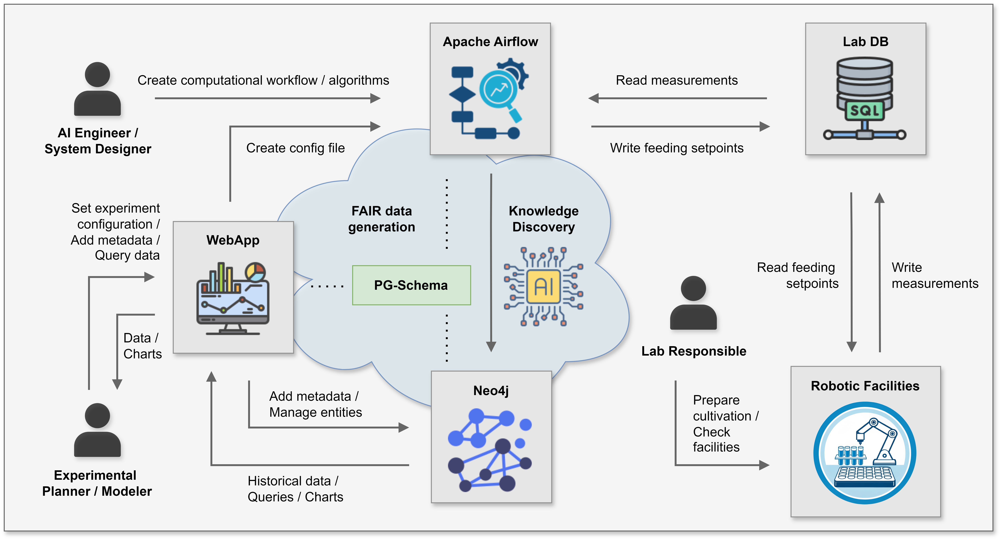

# Experiment simulation with Apache Airflow&#174; and Neo4j DB

Complete documentation and code to reproduce the results of the paper entitled: **"A property graph schema for automated metadata capture, reproducibility and knowledge discovery in high-throughput bioprocess development"**.

## Authors
Federico M. Mione $^a$, Martin F. Luna $^a$, Lucas Kaspersetz $^b$, Peter Neubauer $^b$, Ernesto C. Martinez $^a$ and M. Nicolas Cruz Bournazou $^b$.

$^a$ *INGAR (CONICET - UTN). Avellaneda 3657, Santa Fe, Argentina*  
$^b$ *Technische Universität Berlin, Institute of Biotechnology, Chair of Bioprocess Engineering. Berlin, Germany*

## Overview

The context of this work involves the use of Apache Airflow as a Workflow Management System to handle the execution of the necessary tasks to achieve a specific goal in the experimentation, creating the computational environments required for each step through the instantiation of Docker containers. As shown in the following image, the interaction with robotic devices is carried out through the relational database associated with the devices.

The contribution of this work addresses the formalization of a common schema or vocabulary for the experimentation and its control component, associated with the computational workflow implemented in parallel and directly integrated into the Neo4j database, specifically an LPG. Connected with this graph database, a web interface is implemented to allow different users to access the knowledge stored, to monitor the experimentation online or query historical data, among its main functionalities.

## Reproducibility

### MATLAB License

You must have a valid Matlab license to reproduce the example. The license must be configured for **version R2022a**, specifying the user as **root** and the MAC address as **02:42:ac:11:ff:12** to ensure the Docker container works correctly.

This license file must be named `license.lic` and placed in the `images/matlab/` directory.

### Steps

Keep in mind that the simulation of the experiment is done in real time, therefore, it takes 16 hours.

To reproduce the results, please follow these steps:

* Install [Git](https://git-scm.com/) and [Docker](https://www.docker.com/).

* Clone the repository and get the corresponding branch:

        git clone https://git.tu-berlin.de/bvt-htbd/public/property-graph-schema

* Navigate to the directory created (*property-graph-schema*) and set up the Airflow service:

        docker-compose up -d airflow-init 

* Next, install all the remaining services:

        docker-compose up -d

* Please wait until the installation completes (this may take a couple of minutes), after which you should be able to access the Apache Airflow interface at http://localhost:8080/.
**Log in with user: airflow, and password: airflow.**

* Finally, Airflow variables should be set:

    * In the upper ribbon, navigate to **Admin** > **Variables**.
    * Click on **choose a file**, and locate the *config_matlab.json* file within the *dags* directory.
    * Once the JSON file is uploaded, click on **Import variables**.
    
    **IMPORTANT**: The **variable host_path must be changed** to the actual absolute local path where the */dags* folder is located.

## Run DAGs
Two DAGs are defined: one for the emulator (*Emulator_DAG*) and the other for computational control (*Matlab_DAG*). To execute both, the corresponding toggle buttons must be activated, followed by pressing the play button for each DAG.

IMPORTANT: To run the local emulator (with the ilab database in Docker), ensure that the "emulator_runid" variable is set to 623. Each time the emulator is executed, all experimental data associated with this RUN ID (623) is deleted to start a new simulation.

## Monitoring tool
To monitor the simulated experiments (both online and offline), a tool can be accessed at the following address: http://localhost:8501/

Please, select the simulated experiment with RUN ID 623.

## PG-Schema

Using the work of [PG-Schema](https://dl.acm.org/doi/abs/10.1145/3589778) and its predecesor [PG-Keys](https://dl.acm.org/doi/10.1145/3448016.3457561), you can locate our schema definition in [schema.pgs](/dags/schema/schema.pgs) file.

## Neomodel implementation

An instance of the proposed schema is implemented using [Neomodel](https://neomodel.readthedocs.io/) library. The development process consists of three steps, model definition, calbacks implementation, and nodes integration:

* The complete model definition can be found in the [model.py](dags/scripts/neodb/model.py) file.
* The implementation of the class to define all the available callbacks can be found in the [helper.py](dags/scripts/neodb/helper.py) file.
* The instantiation of the callbacks is included in the definition of each [Airflow node](dags/scripts/nodes/nodes.py).

## Web interface

A detailed description of the web interface is available in the [web](/web/) folder.

To access the platform, please navigate to http://localhost:5000/ and create a new user to log in.

## Neo4j Queries

Neo4j query results and other examples are shown in the [queries](/queries/) folder.

## Acknowledgements

We gratefully acknowledge the financial support of the German Federal Ministry of Education and Research (01DD20002A – KIWI biolab).

## License

This project is under an MIT license. See the [LICENSE](./LICENSE) file for more details.
