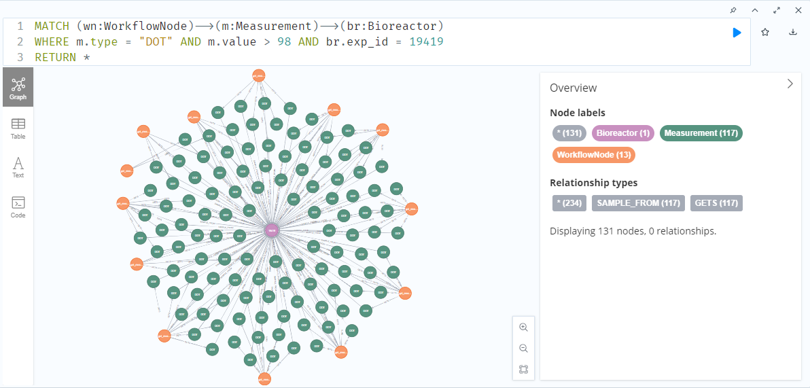
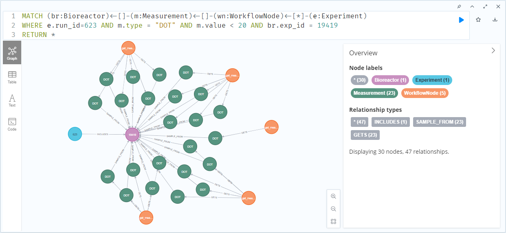
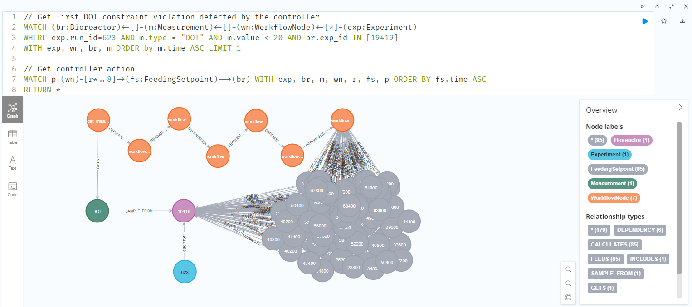
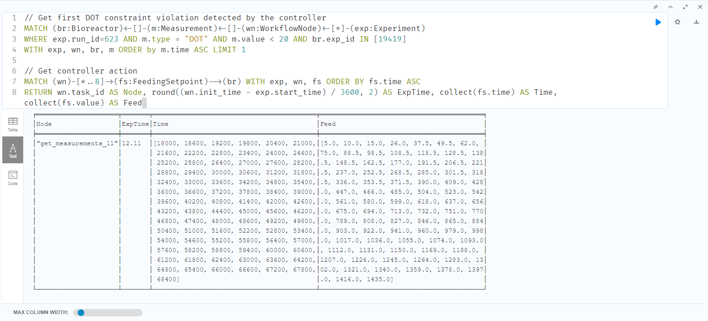
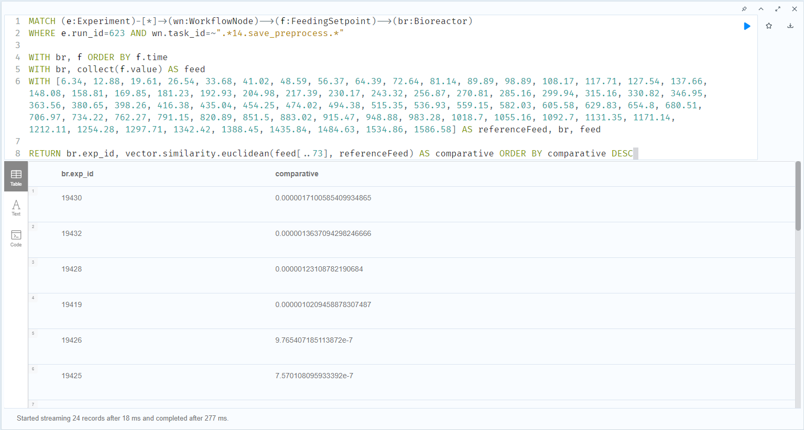
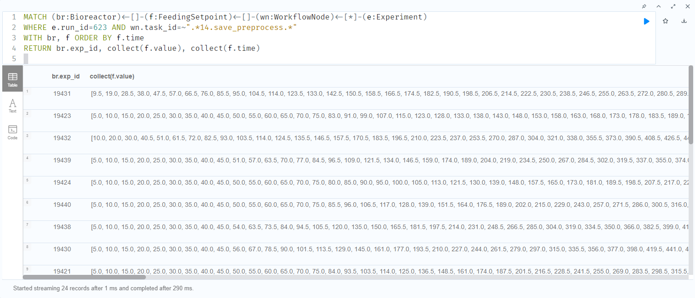
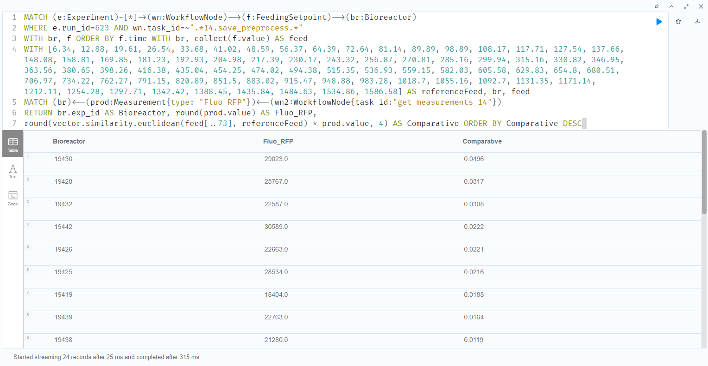
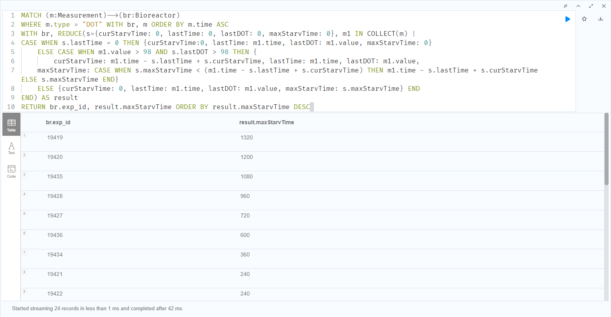

# Neo4j Queries

##### Get all WorkflowNodes and associated Measurements where the DOT value is greater than 98% for MBR ID 19419.

 

##### Get all WorkflowNodes and associated measurements where the DOT value is lower than 20% for MBR ID 19419.

 

##### Get the feeding setpoints adjustment when controller detects a DOT constraint violation (under 20%). Graph showing the relationship between experimental and computational data.

 

##### Get the feeding setpoints adjustment when controller detects a DOT constraint violation (under 20%). Table with experimentation time of the node execution and feeding values.

 

##### Compare a reference Feeding profile against all applied feeds for the MBRs using the vector similarity function.

 

##### Collect all feeding setpoints for each MBR (time and cumulative volume).

 

##### Compare a reference Feeding profile against all applied feeds for the MBRs using the vector similarity function and obtain a score comparative for the maximum product generated. This is called the "safe feeding zone" for maximum Fluo-RFP generation.

 

##### Collect the maximum starving time in seconds for each MBR using Neo4j's listing funtions. Starving time is considered as a DOT value > 98%, indicating that no feeding pulse was detected.

 

